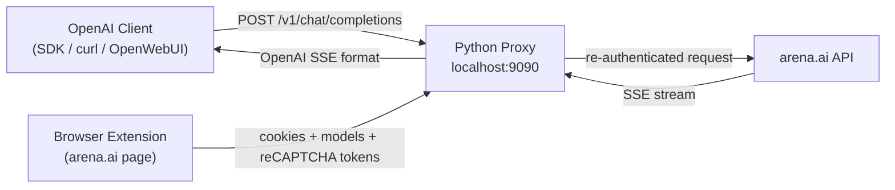

# Arena2API-Fixed

**arena.ai → OpenAI-compatible API.** Use 300+ arena.ai models (Grok, GPT, Claude, Gemini, Llama) through any OpenAI-compatible client at `localhost:9090`.

> **Fork of [flay-o/arena2api](https://github.com/flay-o/arena2api)** — original project by flay-o. This fork adds 429 fixes, on-demand reCAPTCHA, and stability improvements.

---

## Features

- **OpenAI-compatible** — `POST /v1/chat/completions`, `GET /v1/models`, streaming SSE, tool calling. Works with any OpenAI SDK, OpenRouter, OpenWebUI, ChatBox, NextChat, curl.
- **300+ models** — every model on arena.ai through one API.
- **Streaming** — full SSE streaming with `stream: true`.
- **Multi-turn** — pass message history for context-aware responses.
- **Tool calling** — XML-based tool use injection, compatible with OpenAI tool format.
- **Fuzzy model matching** — `grok`, `grok-4.5`, `arena-ai/grok-4.5` all resolve to the same model.
- **On-demand reCAPTCHA** — tokens retrieved from the real browser only when needed (no background farming = higher scores).
- **Firefox + Chrome** — extensions for both browsers.

---

## Quick Start

### 1. Install & Start Server

```bash
pip install -r requirements.txt
python server.py
```

Server listens on `http://localhost:9090`.

### 2. Install Browser Extension

**Chrome:** `chrome://extensions/` → Developer mode → Load unpacked → select `extension/`.

**Firefox:** `about:debugging#/runtime/this-firefox` → Load Temporary Add-on → select `extension-firefox/manifest.json`.

### 3. Open arena.ai

Click extension icon → **Open Arena.ai** (or manually open `https://arena.ai/text/direct`). Wait 3–5 seconds for the page to load.

### 4. Verify

Click extension icon. Expected: Server ✅ Connected, Arena Tab ✅ Active, Auth Cookie ✅ Yes, Models ✅ >0.

### 5. Test with curl

```bash
curl http://localhost:9090/v1/models

curl http://localhost:9090/v1/chat/completions \
  -H "Content-Type: application/json" \
  -d '{"model": "grok-4.5", "messages": [{"role": "user", "content": "Hello!"}]}'

curl -sN http://localhost:9090/v1/chat/completions \
  -H "Content-Type: application/json" \
  -d '{"model": "grok-4.5", "messages": [{"role": "user", "content": "Hello!"}], "stream": true}'
```

---

## Architecture



### On-Demand reCAPTCHA Flow

```
Client POST → server queues request → needs token
  → extension long-poll → "get_token" command
  → content.js routes to injector.js (MAIN world)
  → grecaptcha.enterprise.execute() → token
  → token flows back: injector → content → background → server
  → server fulfills arena.ai request → returns OpenAI response
```

---

## API Reference

### `POST /v1/chat/completions`

OpenAI-compatible. Accepts `model`, `messages`, `stream`, `tools`, `temperature`, `max_tokens`.

**Model resolution:**
| Input | Resolves to |
|-------|-------------|
| `grok-4.5` | grok-4.5 |
| `grok` | grok-4.5 (first fuzzy match) |
| `arena-ai/grok-4.5` | grok-4.5 (strips prefix) |

### `GET /v1/models`

Lists all available models in OpenAI format.

### `GET /health`

Server health + extension connection status.

---

## Configuration

| Env var | Default | Description |
|---------|---------|-------------|
| `PORT` | `9090` | Server port |
| `API_KEY` | (none) | Require `Authorization: Bearer <API_KEY>` |
| `DEBUG` | (none) | Enable debug logging |

---

## Troubleshooting

**429 Too Many Requests / "prompt failed"** — Reload extension (`chrome://extensions/` → refresh Arena2API), refresh arena.ai tab. Server auto-retries once with a fresh token.

**503 Extension not connected** — Ensure arena.ai tab is open and extension is loaded. Click **Push** in the popup.

**reCAPTCHA not available** — Open arena.ai in a real browser window (not headless). `injector.js` needs the page's `grecaptcha.enterprise` object.

**Model not found** — `GET /v1/models` to list. Add custom models via popup UI's model management.

---

## Project Structure

```
arena2api/
├── server.py                 # FastAPI proxy (OpenAI → arena.ai)
├── requirements.txt          # Python dependencies
├── extension/                # Chrome extension (MV3)
│   ├── manifest.json
│   ├── background.js         # Service worker
│   ├── content.js            # ISOLATED world bridge
│   ├── injector.js           # MAIN world (grecaptcha, model extraction)
│   ├── popup.html/js         # Extension popup UI
├── extension-firefox/        # Firefox extension (MV2)
└── scripts/
    └── uuid-finder.js        # Bookmarklet for finding model UUIDs
```

---

## License

MIT

## Credits

Original project by **[flay-o](https://github.com/flay-o/arena2api)** — this fork builds on that work with 429 fixes, on-demand reCAPTCHA, and stability improvements.
